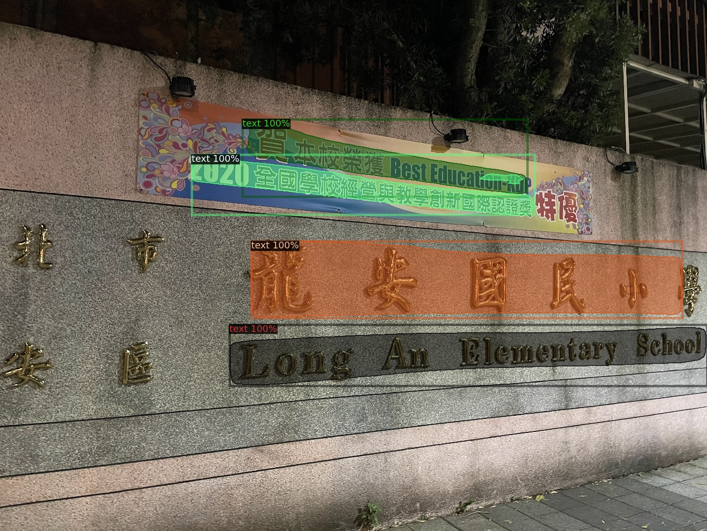

本 text detection 部分參考 [TextFuseNet](https://github.com/ying09/TextFuseNet "TextFuseNet")，使用作者提供的ctw1500權重做text detection預測，權重下載[網址](https://drive.google.com/drive/folders/18Ll-3bAmi4CR2eGTuM-j6fkMrSAaBV4Z?usp=sharing "網址")，下載完的 model_ic15_r101.pth 複製到       TextFuseNet/out_dir_r101/icdar2015_model/資料夾中，待檢測資料放到 TextFuseNet/input_images 中
接著執行 demo/ctw1500_detection.py
```python
python demo/ctw1500_detection.py
```
ctw1500_detection.py跟原作者提供的不一樣，主要流程如下:
1. 預測出的instance mask會經由 **cv2.findcontours()** 找到輪廓
2. **cv2.minAreaRect()** 以及 **cv2.boxPoints()** 找到不規則四邊形的頂點
3. **cv2.getPerspectiveTransform()** 以及 **cv2.warpPerspective()** 對不規則四邊形做透視變換，經由這步驟OCR會更準確，經實驗多出10%表現
4. 儲存直橫兩大類型圖片直的位於 test_ctw1500/img/ 橫的位於 test_ctw1500/yolo/ 檔名為 : **原始檔名+四個順時針座標點+DECECTION信心度**
5. 還會產生原始的輸出圖片跟標出Bounding Box(綠色)，不規則四邊形(藍色)的圖片如下圖


 
 


